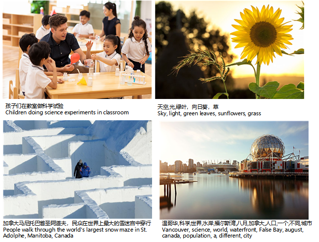

### WuDaoMM 数据集
WuDaoMM属于北京智源人工智能研究院WuDaoCorpora开源数据集的一部分。去年我们开源了全球最大中文文本数据集WuDaoText，包含从100TB原始网页数据中清洗得出5TB的文本。今年开源的WuDaoMM是基于中文图文对的多模态数据，WuDaoMM全量数据集约有6.5亿图文对支持了包含文澜、Cogview等大规模中文多模态预训练模型的训练，数据集包含强相关数据5千万对和弱相关数据6亿对。为了便于研究者下载使用，我们开放了WuDaoMM的基线版本WuDaoMM-base，包含500万强相关图文数据对样例。WuDaoMM-base数据集是从强相关数据集每个大类别中均衡组成的的一个子数据集，足以支持当前主流预训练模型研究使用。如果研究者有全量数据需求，可以邮件与我们联系data@baai.ac.cn。WuDaoMM-base包含19个大类，分别为:能源、表情、工业、医疗、风景、动物、新闻、花卉、教育、艺术、人物、科学、大海、树木、汽车、社交、科技、运动等，单类别数据约7万~40万左右。



#### 下载方式

| Keys     | EXPLAIN      |
| -------- | ------------ |
| tag      | 图像类别     |
| captions | 图像描述     |
| name     | 图像保存名称 |

json文件包含了所有图像的url以及对应描述格式如下

```
{
"name": "3db6c9414b0c2e3d9978c6b1c285e3ab.jpg"
"tag": "工业",
"captions": "天际线,大阪城,日本"
},
```

文件下载地址:https://data.wudaoai.cn/


### 版权问题

WuDaoMM数据集仅用于学术研究，任何使用该数据集都应该遵循以下要求。WuDaoMM不拥有这些图片的版权。 图片的使用必须遵守[Flickr使用条款](http://creativecommons.org/licenses/by/4.0/)。 图像的用户对使用数据集承担全部责任，不私自传播上面的图片。 如果图片的版权受到侵犯，请联系我们，我们将立即删除。  
